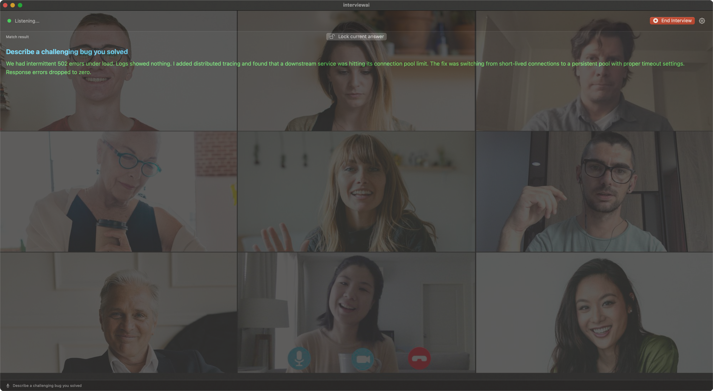
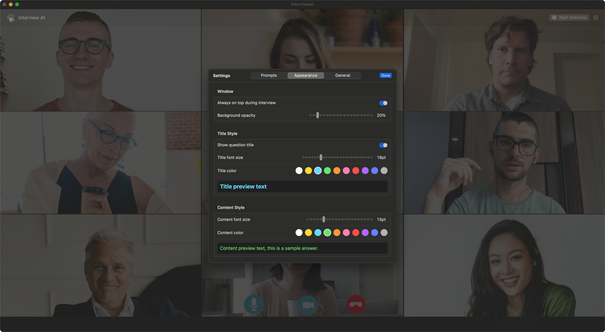
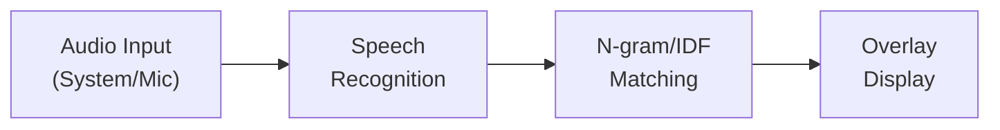

# Interview AI

A macOS overlay app that listens to interview questions in real time and instantly displays your prepared answers.

一款 macOS 浮窗应用，实时监听面试问题并即时展示你预先准备的答案。

<p align="center">
  
  
</p>

## What is InterviewAI / 项目介绍

InterviewAI captures audio during interviews (system audio from Zoom/Teams/Meet or microphone input), transcribes the interviewer's questions using Apple's Speech framework, and matches them against your pre-written prompt library. The best-matching answer is displayed in a transparent overlay window — always on top, always ready.

InterviewAI 在面试过程中捕获音频（来自 Zoom/Teams/Meet 的系统音频或麦克风输入），利用 Apple Speech 框架将面试官的问题转录为文本，并与你预先编写的提示库进行匹配。匹配度最高的答案会显示在透明浮窗中——始终置顶，随时可用。

## Features / 功能特性

- **Real-time speech recognition** — Powered by `SFSpeechRecognizer`, supports 30+ languages
- **System audio capture** — Captures app audio output via `ScreenCaptureKit`, no need for virtual audio devices
- **Local matching** — All processing happens on-device, no network requests, no data leaves your Mac
- **Customizable overlay** — Adjust opacity, font size, colors, and always-on-top behavior
- **Prompt management** — Create, edit, reorder, and search your Q&A library; import via JSON
- **Lock answer** — Pin the current answer to prevent it from changing while you're reading

---

- **实时语音识别** — 基于 `SFSpeechRecognizer`，支持 30+ 种语言
- **系统音频捕获** — 通过 `ScreenCaptureKit` 捕获应用音频输出，无需虚拟音频设备
- **本地匹配** — 所有处理在设备端完成，无网络请求，数据不离开你的 Mac
- **自定义浮窗** — 调整透明度、字体大小、颜色和置顶行为
- **提示管理** — 创建、编辑、排序、搜索问答库；支持 JSON 导入
- **锁定答案** — 固定当前答案，阅读时不会被新匹配替换

## How It Works / 工作流程



1. **Capture** — Audio is captured from system output (ScreenCaptureKit) or microphone
2. **Transcribe** — `SFSpeechRecognizer` converts speech to text in real time
3. **Match & Display** — The transcribed text is matched against your prompt library and the best answer is shown

## Matching Algorithm / 匹配算法

InterviewAI uses a **character-level N-gram matching algorithm with IDF weighting**, designed to work across languages without requiring tokenization or word boundaries.

InterviewAI 使用**字符级 N-gram 匹配算法，结合 IDF 加权**，无需分词即可跨语言工作。

### Indexing Phase / 索引阶段

When an interview starts, all prompts are pre-indexed:

面试开始时，所有提示会被预索引：

- Text is **normalized** (lowercased, punctuation/symbols removed)
- **N-grams** (2, 3, 4-character sliding windows) are extracted from titles and content
- **Character sets** are built for fast single-character lookup
- **IDF scores** are computed per character across all prompt titles:

```
IDF(char) = log(1 + totalDocs / docFreq(char))
```

Characters that appear in fewer prompts get higher weight — rare characters are more informative for matching.

出现在更少提示中的字符获得更高权重——稀有字符对匹配更有价值。

### Scoring Phase / 评分阶段

Each recognized question is scored against every prompt using three layers:

每个识别到的问题通过三层评分与所有提示进行对比：

| Layer | Description | Weight |
|-------|------------|--------|
| **Substring match** | Full title found inside the question | `titleLength × 20` |
| **N-gram overlap** | Shared 2/3/4-grams between question and prompt, IDF-weighted | Title: `× 10`, Content: `× 2` |
| **Character overlap** | Shared individual characters, IDF-weighted | Title: `× 3`, Content: `× 0.5` |

Title matches are weighted **5× higher** than content matches, since interview questions are most likely to overlap with prompt titles.

标题匹配的权重是内容匹配的 **5 倍**，因为面试问题最可能与提示标题重合。

### Confidence Threshold / 置信度阈值

A confidence score is calculated as:

```
confidence = score / maxPossibleScore
```

Results below **15% confidence** are discarded. This prevents weak or irrelevant matches from appearing.

低于 **15% 置信度** 的结果会被丢弃，防止弱匹配或无关匹配出现。

## Requirements / 系统要求

- macOS 14.0 (Sonoma) or later
- Xcode 16.0 or later
- Permissions required:
  - **Microphone** — for mic-based recognition
  - **Speech Recognition** — for on-device transcription
  - **Screen Recording** — for system audio capture (ScreenCaptureKit)

## Build & Run / 编译运行

```bash
git clone https://github.com/RyuApps/interviewai.git
cd interviewai
open interviewai.xcodeproj
```

Select the `interviewai` scheme and run (⌘R). No dependencies, no package managers — pure Swift and system frameworks.

无第三方依赖，纯 Swift + 系统框架，克隆后直接编译运行。

## Project Structure / 项目结构

```
interviewai/
├── Models/                 # Data models (PromptItem, AppSettings, MatchResult)
├── Views/                  # SwiftUI views (MainView, SettingsView, PromptEditor)
├── ViewModels/             # Observable view models (MVVM)
├── Services/               # Core services (Speech, SystemAudio, AI matching, Storage)
├── Managers/               # Session orchestration (InterviewSessionManager)
├── Utilities/              # Constants, logging
└── Resources/              # Sample prompts (JSON)
```

## License / 许可证

[MIT License](LICENSE) — free to use, modify, and distribute.

[MIT 许可证](LICENSE)——可自由使用、修改和分发。
